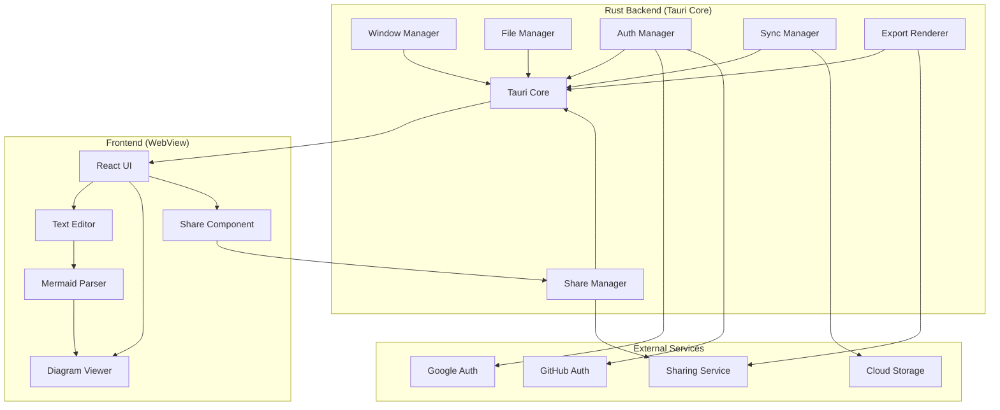

# Design Document

## Overview

Parch is a cross-platform desktop application built using Tauri with a Rust backend, providing developers with a floating, always-accessible window for creating and viewing Mermaid diagrams. The application features a split-pane interface with real-time diagram rendering, cloud synchronization via OAuth authentication, diagram sharing capabilities, and advanced window management capabilities.

The architecture follows a modular design pattern with clear separation between the Rust backend (core logic, file operations, system integration), frontend UI (React/TypeScript), and external services (OAuth providers, cloud storage, sharing services).

## Architecture

### High-Level Architecture



### Technology Stack

- **Framework**: Tauri (Rust backend + WebView frontend)
- **Backend**: Rust with Tauri APIs
- **Frontend**: React with TypeScript
- **Text Editor**: Monaco Editor (VS Code editor component)
- **Diagram Rendering**: Mermaid.js
- **State Management**: Zustand
- **Styling**: Tailwind CSS
- **Authentication**: OAuth 2.0 (Google & GitHub) via Tauri OAuth plugin
- **Cloud Storage**: User's cloud provider APIs
- **Image Export**: Tauri's image processing capabilities
- **Sharing**: Custom sharing service + URL generation
- **Build Tool**: Vite + Tauri CLI
- **Testing**: Jest + React Testing Library + Rust unit tests

## Components and Interfaces

### Rust Backend Components

#### Window Manager
Handles all window-related operations using Tauri's window management APIs.

```rust
#[tauri::command]
pub struct WindowManager;

impl WindowManager {
    pub fn set_always_on_top(&self, window: &Window, enabled: bool) -> Result<(), String>;
    pub fn set_opacity(&self, window: &Window, level: f64) -> Result<(), String>;
    pub fn set_click_through(&self, window: &Window, enabled: bool) -> Result<(), String>;
    pub fn save_window_state(&self, window: &Window) -> Result<(), String>;
    pub fn restore_window_state(&self, window: &Window) -> Result<(), String>;
}
```

#### File Manager
Manages local file operations using Rust's high-performance file I/O and Tauri's dialog APIs.

```rust
#[derive(Serialize, Deserialize)]
pub struct FileContent {
    pub path: String,
    pub content: String,
    pub last_modified: SystemTime,
}

#[tauri::command]
pub struct FileManager;

impl FileManager {
    pub async fn create_new_file(&self) -> Result<(), String>;
    pub async fn open_file(&self) -> Result<FileContent, String>;
    pub async fn save_file(&self, content: &str, path: Option<&str>) -> Result<(), String>;
    pub async fn save_file_as(&self, content: &str) -> Result<String, String>;
    pub fn watch_file_changes(&self, path: &str) -> Result<(), String>;
}
```

#### Authentication Manager
Handles OAuth flows using Tauri's OAuth plugin for secure authentication.

```rust
#[derive(Serialize, Deserialize)]
pub struct User {
    pub id: String,
    pub name: String,
    pub email: String,
    pub avatar: String,
    pub provider: AuthProvider,
}

#[derive(Serialize, Deserialize)]
pub enum AuthProvider {
    Google,
    GitHub,
}

#[derive(Serialize, Deserialize)]
pub struct AuthResult {
    pub success: bool,
    pub user: Option<User>,
    pub token: Option<String>,
    pub error: Option<String>,
}

#[tauri::command]
pub struct AuthManager;

impl AuthManager {
    pub async fn authenticate_with_google(&self) -> Result<AuthResult, String>;
    pub async fn authenticate_with_github(&self) -> Result<AuthResult, String>;
    pub async fn refresh_token(&self) -> Result<AuthResult, String>;
    pub fn logout(&self) -> Result<(), String>;
    pub fn get_current_user(&self) -> Option<User>;
}
```

#### Sync Manager
Manages cloud synchronization of diagram files with high-performance Rust networking.

```rust
#[tauri::command]
pub struct SyncManager;

impl SyncManager {
    pub async fn sync_to_cloud(&self, file: &FileContent) -> Result<(), String>;
    pub async fn sync_from_cloud(&self) -> Result<Vec<FileContent>, String>;
    pub async fn resolve_conflict(&self, local: &FileContent, remote: &FileContent) -> Result<FileContent, String>;
    pub fn enable_offline_mode(&self) -> Result<(), String>;
}
```

#### Share Manager
Handles diagram sharing and export functionality.

```rust
#[derive(Serialize, Deserialize)]
pub struct ShareableContent {
    pub diagram_id: String,
    pub title: String,
    pub content: String,
    pub rendered_svg: String,
    pub share_url: String,
    pub expires_at: Option<SystemTime>,
}

#[derive(Serialize, Deserialize)]
pub struct ExportOptions {
    pub format: ExportFormat,
    pub quality: u8,
    pub background: Option<String>,
    pub scale: f32,
}

#[derive(Serialize, Deserialize)]
pub enum ExportFormat {
    PNG,
    SVG,
    PDF,
    JPEG,
}

#[tauri::command]
pub struct ShareManager;

impl ShareManager {
    pub async fn share_diagram(&self, diagram: &ParsedDiagram, options: ShareOptions) -> Result<ShareableContent, String>;
    pub async fn export_diagram(&self, diagram: &ParsedDiagram, options: ExportOptions) -> Result<Vec<u8>, String>;
    pub async fn generate_share_url(&self, content: &ShareableContent) -> Result<String, String>;
    pub async fn get_shared_diagram(&self, share_id: &str) -> Result<ShareableContent, String>;
}
```

#### Export Renderer
High-performance diagram rendering and export using Rust image processing.

```rust
#[tauri::command]
pub struct ExportRenderer;

impl ExportRenderer {
    pub async fn render_to_svg(&self, mermaid_content: &str) -> Result<String, String>;
    pub async fn render_to_png(&self, svg_content: &str, options: &ExportOptions) -> Result<Vec<u8>, String>;
    pub async fn render_to_pdf(&self, svg_content: &str, options: &ExportOptions) -> Result<Vec<u8>, String>;
    pub fn optimize_svg(&self, svg_content: &str) -> Result<String, String>;
}
```

### Frontend Components

#### Main Application Component
The root React component that orchestrates the entire UI.

```typescript
interface AppState {
  currentFile: FileContent | null;
  isAuthenticated: boolean;
  user: User | null;
  windowSettings: WindowSettings;
  editorContent: string;
  diagrams: ParsedDiagram[];
  shareHistory: ShareableContent[];
}

interface WindowSettings {
  alwaysOnTop: boolean;
  opacity: number;
  clickThrough: boolean;
  splitPaneSize: number;
}
```

#### Text Editor Component
Monaco Editor wrapper with Mermaid syntax highlighting and error detection.

```typescript
interface TextEditorProps {
  content: string;
  onChange: (content: string) => void;
  onCursorChange: (position: Position) => void;
  errors: SyntaxError[];
  highlightRange?: Range;
}

interface SyntaxError {
  line: number;
  column: number;
  message: string;
  severity: 'error' | 'warning';
}
```

#### Diagram Viewer Component
Renders multiple Mermaid diagrams with interactive features and sharing capabilities.

```typescript
interface DiagramViewerProps {
  diagrams: ParsedDiagram[];
  activeIndex: number;
  onDiagramClick: (index: number) => void;
  onDiagramShare: (diagram: ParsedDiagram) => void;
  onDiagramExport: (diagram: ParsedDiagram, options: ExportOptions) => void;
}

interface ParsedDiagram {
  id: string;
  type: string;
  content: string;
  startLine: number;
  endLine: number;
  hasError: boolean;
  errorMessage?: string;
  renderedSvg?: string;
}
```

#### Share Component
Handles diagram sharing and export functionality in the UI.

```typescript
interface ShareComponentProps {
  diagram: ParsedDiagram;
  onShare: (options: ShareOptions) => void;
  onExport: (options: ExportOptions) => void;
  onClose: () => void;
}

interface ShareOptions {
  title: string;
  isPublic: boolean;
  expiresIn?: number; // hours
  allowComments: boolean;
}

interface ShareResult {
  shareUrl: string;
  embedCode: string;
  directImageUrl: string;
}
```

#### Mermaid Parser
Parses text content to extract and validate multiple Mermaid diagrams.

```typescript
interface MermaidParser {
  parseContent(content: string): ParsedDiagram[];
  validateDiagram(diagram: string): ValidationResult;
  renderDiagram(diagram: ParsedDiagram): Promise<string>;
}

interface ValidationResult {
  isValid: boolean;
  errors: SyntaxError[];
}
```

## Data Models

### File Structure
```typescript
interface ProjectFile {
  id: string;
  name: string;
  path: string;
  content: string;
  lastModified: Date;
  lastSynced?: Date;
  isLocal: boolean;
  cloudId?: string;
}
```

### Application Settings
```typescript
interface AppSettings {
  window: WindowSettings;
  editor: EditorSettings;
  sync: SyncSettings;
  theme: ThemeSettings;
}

interface EditorSettings {
  fontSize: number;
  wordWrap: boolean;
  minimap: boolean;
  theme: 'light' | 'dark';
}

interface SyncSettings {
  autoSync: boolean;
  syncInterval: number;
  conflictResolution: 'manual' | 'local' | 'remote';
}
```

## Error Handling

### Error Categories
1. **File System Errors**: Permission issues, file not found, disk space
2. **Network Errors**: Authentication failures, sync conflicts, connectivity issues
3. **Parsing Errors**: Invalid Mermaid syntax, rendering failures
4. **Window Management Errors**: Platform-specific window operation failures

### Error Handling Strategy
- **Graceful Degradation**: Application continues to function with reduced capabilities
- **User Feedback**: Clear error messages with actionable suggestions
- **Retry Mechanisms**: Automatic retry for transient network issues
- **Offline Support**: Local caching when cloud services are unavailable

### Error Recovery
```typescript
interface ErrorHandler {
  handleFileError(error: FileError): void;
  handleNetworkError(error: NetworkError): void;
  handleParsingError(error: ParseError): void;
  showUserNotification(message: string, type: 'error' | 'warning' | 'info'): void;
}
```

## Testing Strategy

### Unit Testing
- **Components**: React component testing with React Testing Library
- **Services**: Mock external dependencies (file system, network)
- **Parsers**: Comprehensive Mermaid syntax validation tests
- **Utilities**: Pure function testing for data transformations

### Integration Testing
- **File Operations**: Test complete file lifecycle (create, edit, save, load)
- **Authentication Flow**: Mock OAuth providers for login/logout testing
- **Sync Operations**: Test conflict resolution and offline scenarios
- **Window Management**: Test platform-specific window behaviors

### End-to-End Testing
- **User Workflows**: Complete user journeys from file creation to diagram viewing
- **Cross-Platform**: Automated testing on Windows, macOS, and Linux
- **Performance**: Diagram rendering performance with large files
- **Memory Usage**: Long-running application stability testing

### Testing Tools
- **Unit**: Jest + React Testing Library
- **Integration**: Electron testing utilities
- **E2E**: Playwright for cross-platform testing
- **Performance**: Electron performance monitoring tools

## Security Considerations

### Authentication Security
- OAuth tokens stored in Electron's secure storage
- Token refresh handling with automatic re-authentication
- Secure communication with OAuth providers

### File System Security
- Sandboxed file access through Electron's security model
- Validation of file paths to prevent directory traversal
- Secure handling of temporary files

### Network Security
- HTTPS-only communication with external services
- Certificate pinning for critical API endpoints
- Input sanitization for cloud sync operations

## Performance Optimization

### Rust Backend Advantages
- **Memory Safety**: Zero-cost abstractions with compile-time memory management
- **Concurrency**: Async/await with Tokio for high-performance I/O operations
- **Small Binary Size**: Tauri produces significantly smaller binaries than Electron
- **Native Performance**: Direct system API access without Node.js overhead

### Diagram Rendering
- Lazy loading of diagrams in multi-diagram documents
- Rust-based SVG optimization and caching
- Debounced re-rendering on text changes (500ms delay)
- Hardware-accelerated image export using native libraries

### Memory Management
- Rust's ownership system prevents memory leaks in backend operations
- Efficient text editor with virtual scrolling for large files
- Smart caching of rendered diagrams with automatic cleanup
- Optimized React re-rendering with proper memoization

### Startup Performance
- Fast Rust binary initialization
- Lazy loading of non-critical frontend modules
- Precompiled Rust components for instant availability
- Optimized bundle splitting for faster WebView load