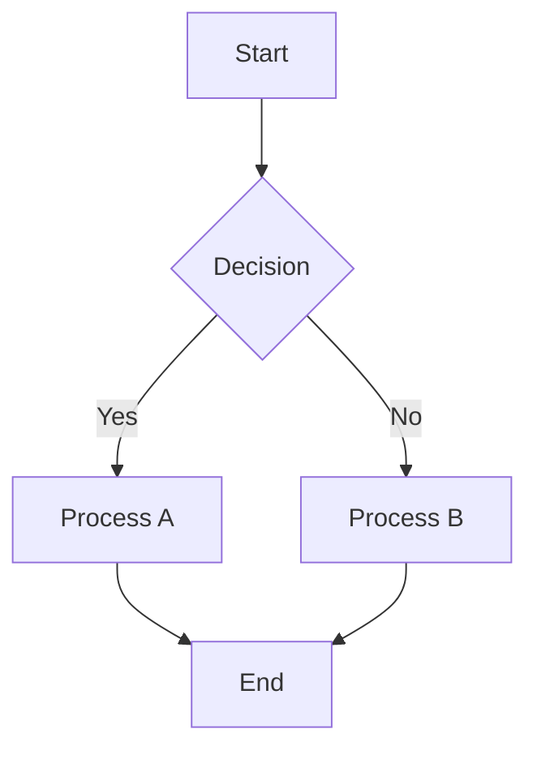
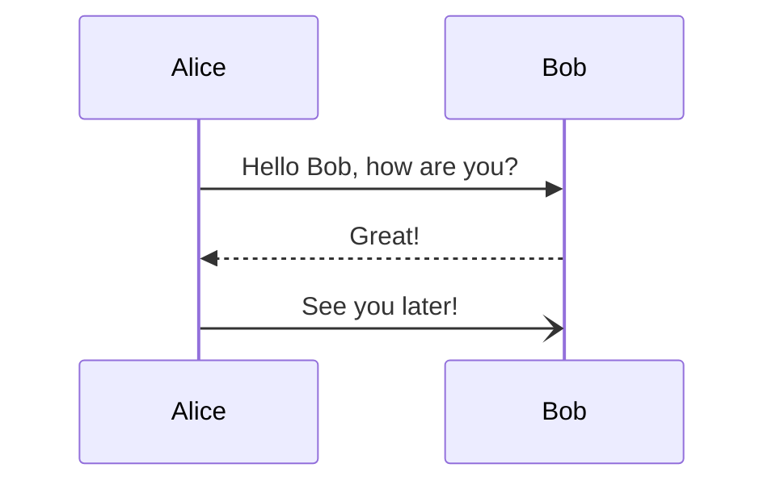
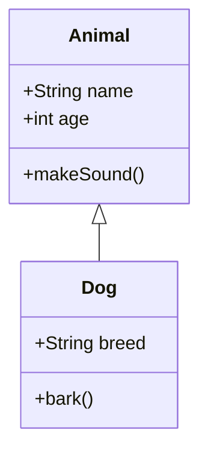
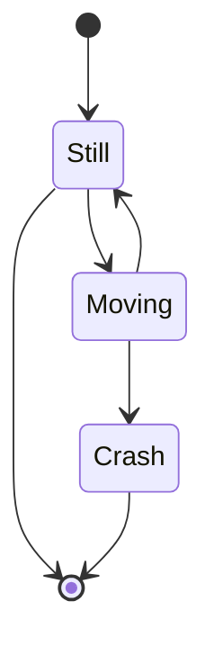
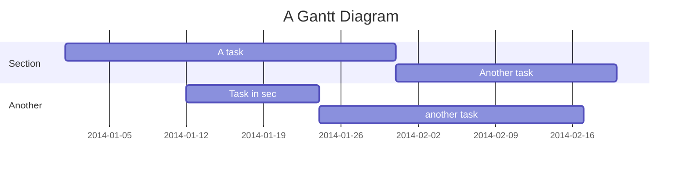

# Test Diagrams

This file contains multiple Mermaid diagrams to test the parsing and rendering functionality.

## Flowchart Example

## Sequence Diagram Example

## Class Diagram Example

## State Diagram Example

## Gantt Chart Example

