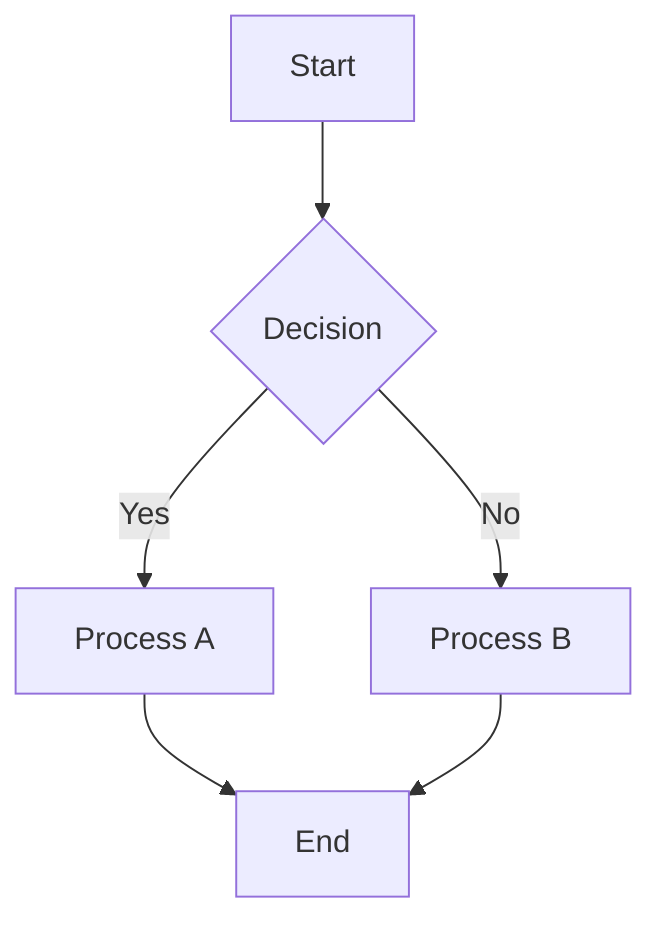
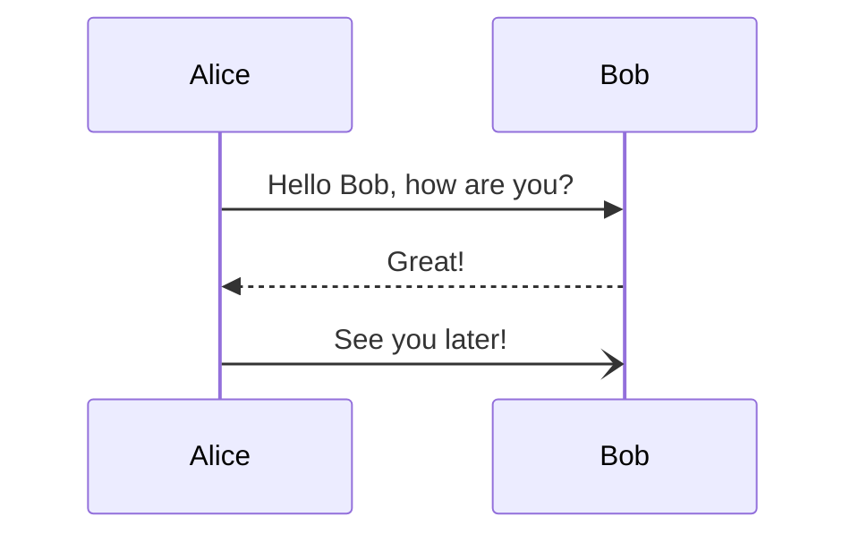
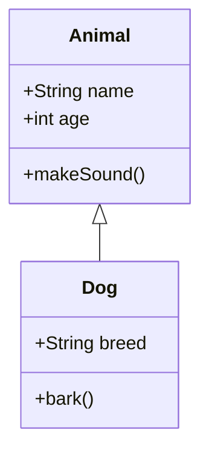

# Test Mermaid Editor

This is a test document with multiple Mermaid diagrams to verify the text editor functionality.

## Flowchart Example



## Sequence Diagram Example



## Invalid Diagram (should show error)

```mermaid
graph TD
    A[Start] --> B[
    // Missing closing bracket - should cause syntax error
```

## Class Diagram Example

